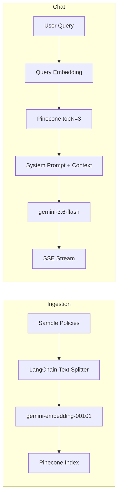

# Enterprise Banking RAG Assistant

A policy-grounded banking compliance chatbot built with Next.js App Router, Vercel AI SDK, Google Gemini, and Pinecone vector search.

## Architecture

This application implements a **Retrieval-Augmented Generation (RAG)** pipeline that grounds every assistant response in official banking policy documents stored in a vector database.



### RAG Pipeline

1. **Document ingestion** — Four detailed banking policies (Accounts, Cards, Transfers, Compliance) are split into ~700-character chunks using LangChain's `RecursiveCharacterTextSplitter` (100-character overlap).
2. **Embedding** — Each chunk is embedded with Google's `gemini-embedding-001` model via `@google/genai`.
3. **Vector indexing** — Embeddings are upserted to a Pinecone index (`banking-guidelines`) with metadata: `text`, `category`, and `policyId`.

### Retrieval & Generation

1. The user's latest message is embedded with the same model.
2. Pinecone returns the top 3 most similar policy chunks (`topK: 3`, `includeMetadata: true`).
3. Retrieved context is injected into a compliance system prompt that instructs the model to cite policy IDs and refuse transactions.
4. `gemini-3.6-flash` generates a streaming response via the Vercel AI SDK.

### SSE Streaming

- **Server**: `streamText()` from the `ai` package streams tokens from Gemini; `toUIMessageStreamResponse()` sends them to the client over Server-Sent Events.
- **Client**: `useChat()` from `@ai-sdk/react` with `DefaultChatTransport` consumes the stream and renders token-by-token updates in the chat UI.

## Tech Stack

| Layer | Technology |
|-------|-----------|
| Framework | Next.js 16 (App Router) |
| LLM | Gemini 2.5 Flash via `@ai-sdk/google` |
| Embeddings | gemini-embedding-001 via `@google/genai` |
| Vector DB | Pinecone (`@pinecone-database/pinecone`) |
| Orchestration | Vercel AI SDK (`ai`, `@ai-sdk/react`) |
| Text Splitting | LangChain (`@langchain/textsplitters`) |
| UI | shadcn/ui, Tailwind CSS, Lucide icons |

## Setup

### 1. Install dependencies

```bash
npm install
```

### 2. Configure environment variables

Create `.env.local` in the project root:

```env
GOOGLE_GENERATIVE_AI_API_KEY="your-google-api-key"
PINECONE_API_KEY="your-pinecone-api-key"
PINECONE_INDEX_NAME="banking-guidelines"
```

### 3. Create Pinecone index

Create a serverless index named `banking-guidelines` with:

- **Dimension**: 3072 (default output for `gemini-embedding-001`)
- **Metric**: cosine

### 4. Ingest policy documents

Start the dev server, then trigger ingestion:

```bash
npm run dev
curl -X POST http://localhost:3000/api/ingest
```

Expected response: `{ "success": true }`

### 5. Chat

Open [http://localhost:3000](http://localhost:3000) and ask policy questions. Responses cite policy IDs like `[Policy: POL-ACC-001]`.

## Project Structure

```
app/
  api/
    chat/route.ts      # RAG retrieval + streaming chat
    ingest/route.ts    # Policy document ingestion
  page.tsx             # Chat UI entry point
components/
  banking-chat.tsx     # Dark-themed compliance chat interface
lib/
  rag/
    types.ts           # BankingChunk interface
    sample-documents.ts # Four detailed banking policies
    ingest.ts          # Split, embed, upsert pipeline
```

## API Routes

| Method | Path | Description |
|--------|------|-------------|
| POST | `/api/ingest` | Ingest sample policies into Pinecone |
| POST | `/api/chat` | Stream RAG-grounded chat responses |

## Sample Policies

| Policy ID | Category | Topic |
|-----------|----------|-------|
| POL-ACC-001 | Accounts | IBAN letter generation |
| POL-CARD-104 | Cards | Credit limit increase & chargebacks |
| POL-TRF-302 | Transfers | International wire & SWIFT routing |
| POL-COMP-880 | Compliance | KYC/AML renewal mandates |
